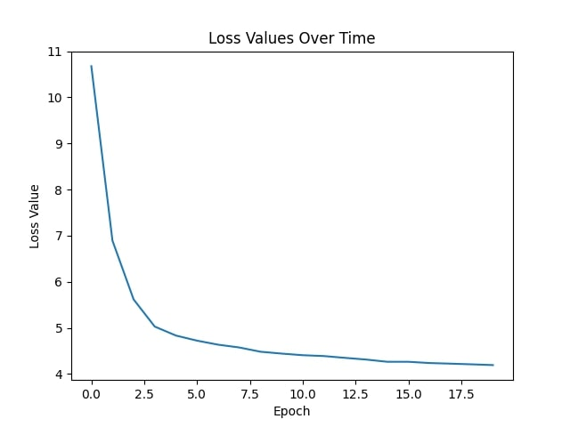

# RobotDockCenter
 Applying machine learning techniques to create an automatic charge docking system for robots.

This project utilizes the Godot game engine in order to retrieve image data. It aims to automate the docking of robots into their charging stations.

**Current Data Info:**

```
6630 images
```

**Current loss curve:**
✅

**trained with:**
```
learning_rate = 0.0001
batch_size = 8
num_epochs = 20

weight_distance = .85
weight_rotation_value = .9
```