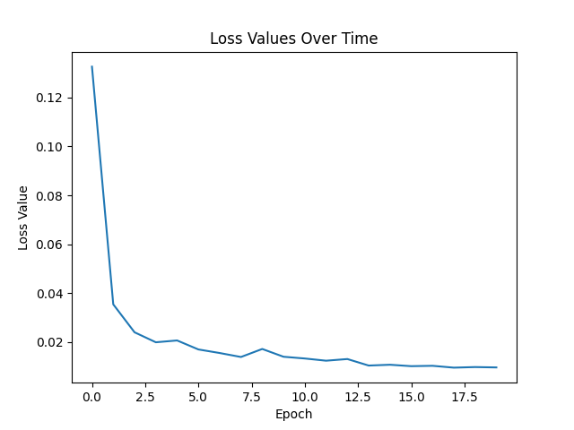

# RobotDockCenter
Applying machine learning techniques to create an automatic charge docking system for robots.

This project utilizes the Godot game engine in order to train & inference on synthetic image data. We use the game engine to simulate the robot docking process & optimize our methodology. Our main goal is to automate the docking of robots into their charging stations in a light-weight manner.

**PLEASE READ:**
> [!CAUTION]
> This project is still in heavy development and should be handled with caution. The code is not yet covered by tests, and is not documented fully. I have posted this sub-part of a bigger project (read below) as a way to show my progress on what I am currently working on.
 
> [!NOTE]
> This project is part of a larger project that will be released soon. That project has not been published yet, as it still needs to be developed further (is quite huge altogether). Also, the paper is still under development for this project as well.

## **Current Progress:**
**A new method is being implemented and tested.** Before, we relied strictly on game engine labels for training, which were unrealistic to get in the real world. This new version works slightly differently, but is actually possible to translate to the real world. You can read more about it [here](/docs/the_new_method.md).

## **Current Godot Engine Version Used:**
**4.3**

**Docking Demo (1-30-25)**

[DockingDemo](https://github.com/user-attachments/assets/17d77959-a484-4489-93ab-d440e66e084c)

**Current Data Info:**

```
There are around 4000 images that were used to train each model
```

**Loss Graph (average loss reporting)**



**trained with:**
```
learning_rate = 0.0005
batch_size = 32
num_epochs = 20
```
**For each of the two custom models**, they are trained with sometimes different parameters. For example, the first one converges much better if our custom augmentation of vertically flipping images randomly with p=.5 is **not** used. The second model converges better with this augmentation. This is something that I am still trying to understand, but it is interesting to see how different models can be trained with different parameters. I talk more about this in the [new method](/docs/the_new_method.md) documentation.

> [!NOTE]
> If you want to know how the current method works, please read the [new method](/docs/the_new_method.md) documentation. I also explain how the current version uses three models, which can also be translated to one, single yolo model!
> Keep in mind that our goal for this docking process is to have light-weight models that even a Raspberry Pi can run sufficiently. This makes computer power a constraint, and something to keep in mind. There is so much to write about in the RobotDockCenter paper and I am very excited to share my thoughts.